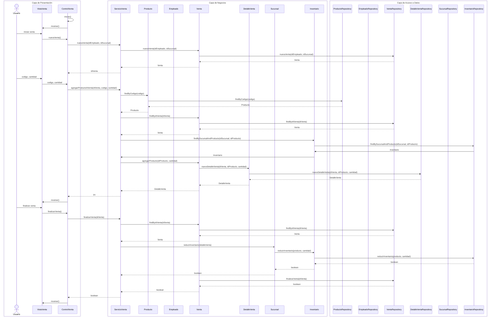

# HU-01

## Diagrama de secuencia

### Realizar venta

```mermaid
sequenceDiagram
    box Capa de Presentación
        Actor U as Usuario
        Participant VV as VistaVenta
        Participant CV as ControlVenta
    end
    box Capa de Negocios
        Participant SV as ServicioVenta
        Participant MP as Producto
        Participant ME as Empleado
        Participant MV as Venta
        Participant MD as DetalleVenta
        Participant MS as Sucursal
        Participant MI as Inventario
    end
    box Capa de Acceso a Datos
        Participant RP as ProductoRepository
        Participant RE as EmpleadoRepository
        Participant RV as VentaRepository
        Participant RD as DetalleVentaRepository
        Participant RS as SucursalRepository
        Participant RI as InventarioRepository
    end

    CV ->> CV: iniciar()
    CV ->> VV: mostrar()

    U ->> VV: iniciar venta
    VV ->> CV: nuevaVenta()
    CV ->> SV: nuevaVenta(idEmpleado, idSucursal)
    SV ->> MV: nuevaVenta(idEmpleado, idSucursal)
    MV ->> RV: nuevaVenta(idEmpleado, idSucursal)
    RV -->> MV: Venta
    MV -->> SV: Venta
    SV -->> CV: idVenta

    U ->> VV: codigo, cantidad
    VV ->> CV: codigo, cantidad
    CV ->> SV: agregarProductoAVenta(idVenta, codigo, cantidad)
    SV ->> MP: findByCodigo(codigo)
    MP ->> RP: findByCodigo(codigo)
    RP -->> MP: Producto
    MP -->> SV: Producto
    SV ->> MV: findByIdVenta(idVenta)
    MV ->> RV: findByIdVenta(idVenta)
    RV -->> MV: Venta
    MV -->> SV: Venta
    SV ->> MI: findBySucursalAndProducto(idSucursal, idProducto) 
    MI ->> RI: findBySucursalAndProducto(idSucursal, idProducto)
    RI ->> MI: Inventario
    MI ->> SV: Inventario
    SV ->> MV: agregarProducto(idProducto, cantidad)
    MV ->> MD: nuevoDetalleVenta(idVenta, idProducto, cantidad)
    MD ->> RD: nuevoDetalleVenta(idVenta, idProducto, cantidad)
    RD -->> MD: DetalleVenta
    MD -->> MV: DetalleVenta
    MV -->> SV: DetalleVenta
    SV -->> CV: int
    CV ->> VV: mostrar()
 
    U ->> VV: finalizar venta
    VV ->> CV: finalizarVenta()
    CV ->> SV: finalizarVenta(idVenta)
    SV ->> MV: findByIdVenta(idVenta)
    MV->>RV: findByIdVenta(idVenta)
    RV -->> MV: Venta
    MV -->> SV: Venta
    SV ->> MS: reducirInventario(detalleVenta)
    MS ->> MI: reducirInventario(producto, cantidad)
    MI ->> RI: reducirInventario(producto, cantidad)
    RI -->> MI: boolean
    MI -->> MS: boolean
    MS -->> SV: boolean
    MV ->> RV: finalizarVenta(idVenta)
    RV -->> MV: boolean
    MV -->> SV: boolean 
    SV -->> CV: boolean
    CV ->> VV: mostrar()

``` 