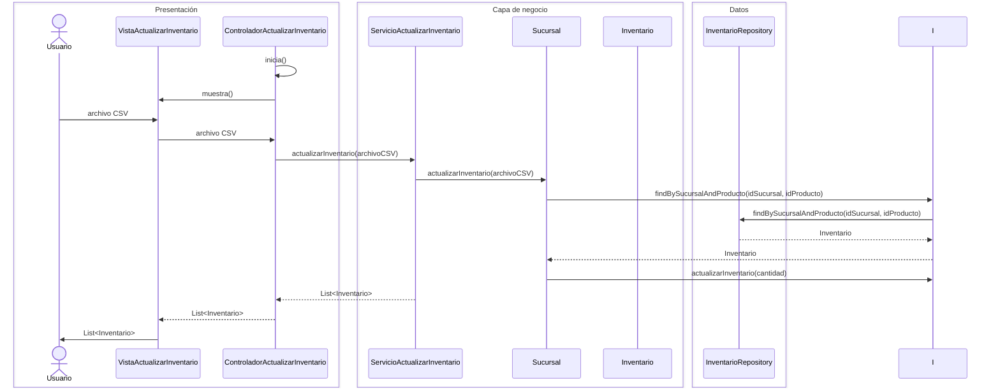

# Secuencias de HU-03

## Actualizar Inventario por CSV

```mermaid
sequenceDiagram
    box Presentación
    Actor U as Usuario
    Participant V as VistaActualizarInventario
    Participant C as ControladorActualizarInventario
    end
    box Capa de negocio
    Participant S as ServicioActualizarInventario
    Participant SM as Sucursal
    Participant IM as Inventario
    end 
    box Datos
    Participant IR as InventarioRepository
    end
    C ->> C: inicia()
    C ->> V: muestra()
    U ->> V: archivo CSV
    V ->> C: archivo CSV
    C ->> S: actualizarInventario(archivoCSV)
    S ->> SM: actualizarInventario(archivoCSV)
    SM ->> I: findBySucursalAndProducto(idSucursal, idProducto)
    I ->> IR: findBySucursalAndProducto(idSucursal, idProducto)
    IR -->> I: Inventario
    I -->> SM: Inventario
    SM ->> I: actualizarInventario(cantidad)
    S -->> C: List<Inventario>
    C -->> V: List<Inventario>
    V ->> U: List<Inventario>
```