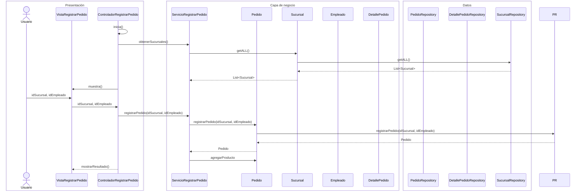

# Secuencias HU-05

## Registrar pedido

```mermaid
sequenceDiagram
    box Presentación
    Actor U as Usuario
    Participant V as VistaRegistrarPedido
    Participant C as ControladorRegistrarPedido
    end
    box Capa de negocio
    Participant S as ServicioRegistrarPedido
    Participant PM as Pedido
    Participant SM as Sucursal
    Participant EM as Empleado
    Participant DM as DetallePedido
    end 
    box Datos
    Participant R as PedidoRepository
    Participant DR as DetallePedidoRepository
    Participant SR as SucursalRepository
    end
    C ->> C: inicia()
    C ->> S: obtenerSucursales()
    S ->> SM: getALL()
    SM ->> SR: getALL()
    SR -->> SM: List<Sucursal>
    SM -->> S: List<Sucursal>
    C ->> V: muestra()
    U ->> V: idSucursal, idEmpleado
    V ->> C: idSucursal, idEmpleado
    C ->> S: registrarPedido(idSucursal, idEmpleado)
    S ->> PM: registrarPedido(idSucursal, idEmpleado)
    PM ->> PR: registrarPedido(idSucursal, idEmpleado)
    PR -->> PM: Pedido
    PM -->> S: Pedido
    S ->> PM: agregarProducto
    C -->> V: mostrarResultado()
```