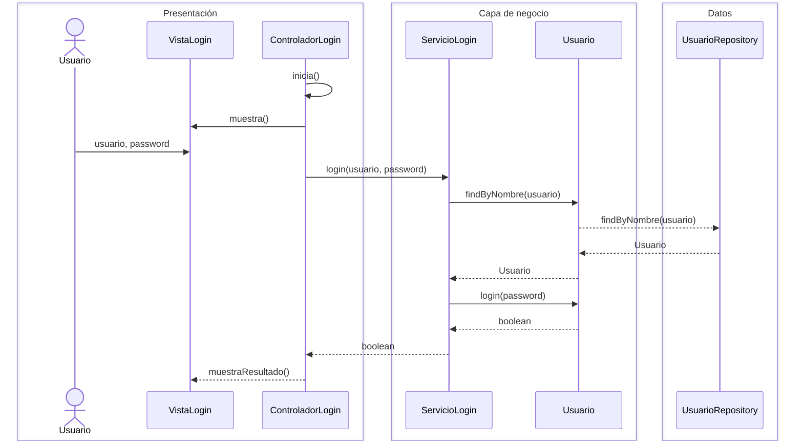
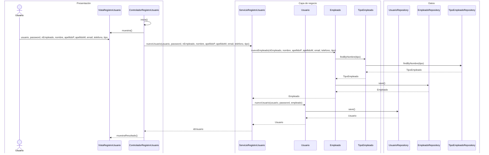
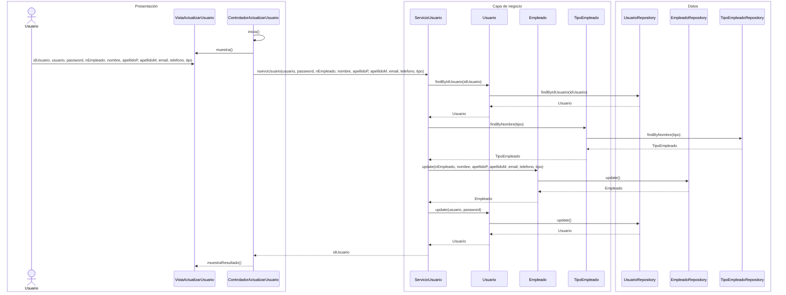

# HU-15 Secuencias

## Login

```mermaid
sequenceDiagram
    box Presentación
    actor U as Usuario
    Participant V as VistaLogin
    Participant C as ControladorLogin
    end
    box Capa de negocio
    Participant S as ServicioLogin
    Participant UM as Usuario
    end 
    box Datos
    Participant R as UsuarioRepository
    end
    C ->> C: inicia()
    C ->> V: muestra()
    U ->> V: usuario, password
    C ->> S: login(usuario, password)
    S ->> UM: findByNombre(usuario)
    UM -->> R: findByNombre(usuario)
    R -->> UM: Usuario
    UM -->> S: Usuario
    S ->> UM: login(password)
    UM -->> S: boolean
    S -->> C: boolean
    C -->> V: muestraResultado()
```

## Registro

```mermaid
sequenceDiagram
    box Presentación
    actor U as Usuario
    Participant V as VistaRegistroUsuario
    Participant C as ControladorRegistroUsuario
    end
    box Capa de negocio
    Participant S as ServicioRegistroUsuario
    Participant UM as Usuario
    Participant EM as Empleado
    Participant TM as TipoEmpleado
    end 
    box Datos
    Participant UR as UsuarioRepository
    Participant ER as EmpleadoRepository
    Participant TR as TipoEmpleadoRepository
    end
    C ->> C: inicia()
    C ->> V: muestra()
    U ->> V: usuario, password, nEmpleado, nombre, apellidoP, apellidoM, email, telefono, tipo
    C ->> S: nuevoUsuario(usuario, password, nEmpleado, nombre, apellidoP, apellidoM, email, telefono, tipo)
    S ->> EM: nuevoEmpleado(nEmpleado, nombre, apellidoP, apellidoM, email, telefono, tipo)
    EM ->> TM: findByNombre(tipo)
    TM ->> TR: findByNombre(tipo)
    TR -->> TM: TipoEmpleado
    TM -->> EM: TipoEmpleado
    EM ->> ER: save()
    ER -->> EM: Empleado
    EM -->> S: Empleado
    S ->> UM: nuevoUsuario(usuario, password, empleado)
    UM ->> UR: save()
    UR -->> UM: Usuario
    UM -->> S: Usuario
    S -->> C: idUsuario
    C -->> V: muestraResultado()
```

## Actualizar Usuario

```mermaid
sequenceDiagram
    box Presentación
    actor U as Usuario
    Participant V as VistaActualizarUsuario
    Participant C as ControladorActualizarUsuario
    end
    box Capa de negocio
    Participant S as ServicioUsuario
    Participant UM as Usuario
    Participant EM as Empleado
    Participant TM as TipoEmpleado
    end 
    box Datos
    Participant UR as UsuarioRepository
    Participant ER as EmpleadoRepository
    Participant TR as TipoEmpleadoRepository
    end
    C ->> C: inicia()
    C ->> V: muestra()
    U ->> V: idUsuario, usuario, password, nEmpleado, nombre, apellidoP, apellidoM, email, telefono, tipo
    C ->> S: nuevoUsuario(usuario, password, nEmpleado, nombre, apellidoP, apellidoM, email, telefono, tipo)
    S ->> UM: findByIdUsuario(idUsuario)
    UM ->> UR: findByIdUsuario(idUsuario)
    UR -->> UM: Usuario
    UM -->> S: Usuario
    S ->> TM: findByNombre(tipo)
    TM ->> TR: findByNombre(tipo)
    TR -->> TM: TipoEmpleado
    TM -->> S: TipoEmpleado
    S ->> EM: update(nEmpleado, nombre, apellidoP, apellidoM, email, telefono, tipo)
    EM ->> ER: update()
    ER -->> EM: Empleado
    EM -->> S: Empleado
    S ->> UM: update(usuario, password)
    UM ->> UR: update()
    UR -->> UM: Usuario
    UM -->> S: Usuario
    S -->> C: idUsuario
    C -->> V: muestraResultado()
``` 