# Modelo de Dominio - Pahcalli

Este documento describe el modelo de dominio del sistema Pahcalli.

## Diagrama de Clases

```mermaid
classDiagram
    class Producto {
        -Long idProducto
        -String nombre
        -String descripcion
        -String contenido
        -Boolean receta
        -Double precio
        -Laboratorio laboratorio
        -CategoriaProducto categoria
        -Ingrediente ingrediente

    }

    class CategoriaProducto {
        -Long idCategoria
        -String nombre
        -String descripcion
    }

    class Ingrediente {
        -Long idIngrediente
        -String nombre
        -String descripcion
    }

    class Laboratorio {
        -Long idLaboratorio
        -String nombre
    }

    class Usuario {
        -Long idUsuario
        -String nombreUsuario
        -String password
    }

    class Empleado {
        -Long idEmpleado
        -String nombre
        -String apellidoPaterno
        -String apellidoMaterno
        -String numeroEmpleado
        -String correoElectronico
        -String telefono
        -TipoEmpleado tipo
    }

    class TipoEmpleado {
        -Long idTipo
        -String nombre
    }
    
    class Almacen {
        -Long idAlmacen
        -Producto producto
        -Integer cantidad
    }

    class Venta {
        -Long idVenta
        -Empleado empleado
        -Date fecha
        -Double precioTotal
        -Integer cantidadProductos
    }

    class DetalleVenta {
        -Long idDetalleVenta
        -Venta venta
        -Producto producto
        -Integer cantidad
        -Double precioUnitario
    }

    class Sucursal {
        -Long idSucursal
        -String nombre
        -String direccion
        -String telefono
        -Empleado gerente
    }

    class Inventario {
        -Long idInventario
        -Producto producto
        -Sucursal sucursal
        -Integer cantidad
    }

    class Pedido {
        -Long idPedido
        -Sucursal sucursal
        -Date fecha
        -Integer cantidadProductos
        -Empleado empleado
    }

    class DetallePedido {
        -Long idDetallePedido
        -Pedido pedido
        -Producto producto
        -Integer cantidad
    }

    class Promocion {
        -Long idPromocion
        -Sucursal sucursal
        -Date fecha
        -Double porcentaje
        -Producto producto
    }

    Producto "*" -- "1" CategoriaProducto : pertenece a
    Producto "*" -- "1" Ingrediente : contiene
    Producto "*" -- "1" Laboratorio : fabricado por
    Usuario "1" -- "1" Empleado : tiene
```

## Descripción de Entidades

### Producto
Representa un producto farmacéutico o medicamento en el sistema.
- **idProducto**: Identificador único del producto
- **nombre**: Nombre comercial del producto
- **descripcion**: Descripción detallada del producto
- **precio**: Precio de venta del producto
- **existencias**: Cantidad disponible en inventario

### CategoriaProducto
Clasifica los productos en diferentes categorías.
- **idCategoria**: Identificador único de la categoría
- **nombre**: Nombre de la categoría
- **descripcion**: Descripción de la categoría

### Ingrediente
Representa los componentes o principios activos de los productos.
- **idIngrediente**: Identificador único del ingrediente
- **nombre**: Nombre del ingrediente
- **descripcion**: Descripción o detalles del ingrediente

### Laboratorio
Representa el fabricante o laboratorio que produce los productos.
- **idLaboratorio**: Identificador único del laboratorio
- **nombre**: Nombre del laboratorio

### Usuario
Representa una cuenta de usuario en el sistema.
- **idUsuario**: Identificador único del usuario
- **nombreUsuario**: Nombre de usuario para iniciar sesión
- **password**: Contraseña del usuario

### Empleado
Representa a un empleado de la farmacia.
- **idEmpleado**: Identificador único del empleado
- **nombre**: Nombre del empleado
- **apellidoPaterno**: Apellido paterno del empleado
- **apellidoMaterno**: Apellido materno del empleado
- **numeroEmpleado**: Número de identificación del empleado
- **correoElectronico**: Correo electrónico del empleado
- **telefono**: Número telefónico del empleado
- **tipo**: Tipo de empleado 

### TipoEmpleado
Define los diferentes tipos de empleados que pueden existir en el sistema.
- **idTipo**: Identificador único del tipo de empleado
- **nombre**: Nombre del tipo de empleado (ej: Gerente, Farmacéutico, Cajero)

### Almacen
Representa el almacenamiento de productos en el sistema.
- **idAlmacen**: Identificador único del almacen
- **producto**: Producto almacenado
- **cantidad**: Cantidad de unidades disponibles

### Venta
Representa una transacción de venta en la farmacia.
- **idVenta**: Identificador único de la venta
- **empleado**: Empleado que realizó la venta
- **fecha**: Fecha de la venta
- **precioTotal**: Monto total de la venta
- **cantidadProductos**: Número total de productos vendidos

### DetalleVenta
Representa los detalles de cada producto en una venta.
- **idDetalleVenta**: Identificador único del detalle
- **venta**: Venta a la que pertenece
- **producto**: Producto vendido
- **cantidad**: Cantidad de unidades vendidas
- **precioUnitario**: Precio unitario del producto

### Sucursal
Representa una sucursal de la cadena de farmacias.
- **idSucursal**: Identificador único de la sucursal
- **nombre**: Nombre de la sucursal
- **direccion**: Dirección física de la sucursal
- **telefono**: Teléfono de contacto de la sucursal
- **gerente**: Gerente asignado a la sucursal

### Inventario
Representa el inventario de productos en una sucursal.
- **idInventario**: Identificador único del registro de inventario
- **producto**: Producto en inventario
- **sucursal**: Sucursal donde se encuentra el producto
- **cantidad**: Cantidad disponible en la sucursal

### Pedido
Representa un pedido realizado por una sucursal.
- **idPedido**: Identificador único del pedido
- **sucursal**: Sucursal que realiza el pedido
- **fecha**: Fecha del pedido
- **cantidadProductos**: Número total de productos pedidos
- **empleado**: Empleado que realizó el pedido

### DetallePedido
Representa los detalles de cada producto en un pedido.
- **idDetallePedido**: Identificador único del detalle
- **pedido**: Pedido al que pertenece
- **producto**: Producto pedido
- **cantidad**: Cantidad de unidades pedidas

### Promocion
Representa una promoción activa en una sucursal.
- **idPromocion**: Identificador único de la promoción
- **sucursal**: Sucursal donde se aplica la promoción
- **fecha**: Fecha de la promoción
- **porcentaje**: Porcentaje de descuento
- **producto**: Producto al que se aplica la promoción

## Relaciones

1. Un Producto pertenece a una CategoriaProducto (relación muchos a uno)
2. Un Producto contiene un Ingrediente (relación muchos a uno)
3. Un Producto es fabricado por un Laboratorio (relación muchos a uno)
4. Un Usuario tiene un Empleado asociado (relación uno a uno)
5. Una Sucursal tiene un Gerente (relación uno a uno)
6. Un Pedido tiene múltiples DetallePedido (relación uno a muchos)
7. Una Venta tiene múltiples DetalleVenta (relación uno a muchos)
8. Un Producto puede estar en múltiples Sucursales a través de Inventario (relación muchos a muchos)
9. Una Sucursal puede tener múltiples Promociones (relación uno a muchos)